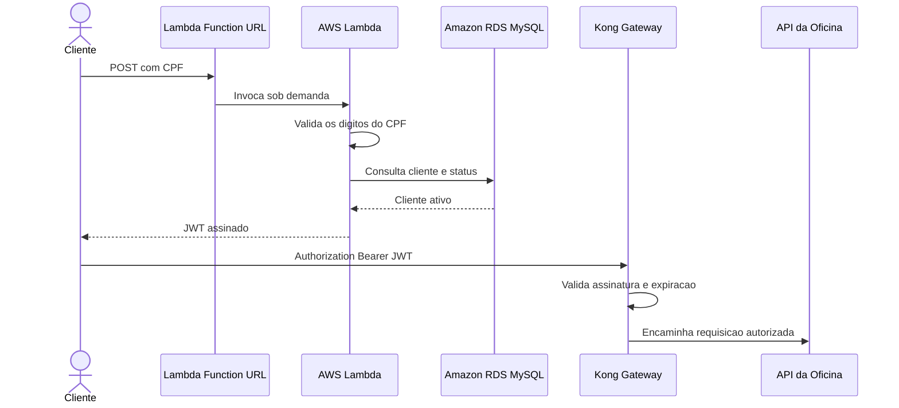

# Oficina Mecanica - Autenticacao Serverless

Function Serverless responsavel por autenticar clientes pelo CPF. A funcao
valida o documento, consulta a existencia e o status do cliente no Amazon RDS
MySQL e emite um JWT aceito pela API principal e pelo Kong Gateway.

## Fluxo



O endpoint usa HTTPS fornecido pela Function URL. A funcao roda nas sub-redes
privadas da plataforma e o Security Group do RDS aceita MySQL apenas a partir do
Security Group da Lambda.

## Tecnologias

- C# e .NET 10;
- AWS Lambda com runtime gerenciado;
- Lambda Function URL;
- Amazon RDS MySQL;
- Terraform;
- GitHub Actions;
- xUnit;
- MySqlConnector.

Nao existe Dockerfile porque a funcao usa o runtime gerenciado do Lambda e e
publicada como pacote ZIP. Nao ha servidor ou container para manter ligado.

## Clean Architecture

```text
src/OficinaMecanica.Auth.Domain
  Entidade de cliente, sem dependencia externa

src/OficinaMecanica.Auth.Application
  Caso de uso e interfaces dos gateways

src/OficinaMecanica.Auth.Infrastructure
  Validacao de CPF, acesso MySQL e geracao JWT

src/OficinaMecanica.Auth.Function
  Entrada HTTP e composicao das dependencias da Lambda
```

As camadas internas nao conhecem AWS, Terraform, MySQL ou pacotes de framework.

## Contrato HTTP

Requisicao:

```http
POST /
Content-Type: application/json
```

```json
{
  "cpf": "52998224725"
}
```

Resposta de sucesso:

```json
{
  "clienteId": "51bb62d7-a815-4f26-8791-2756991da091",
  "nome": "Cliente Teste",
  "cpf": "52998224725",
  "status": "Ativo",
  "token": "eyJ...",
  "expiraEm": "2026-09-12T18:00:00+00:00"
}
```

Possiveis respostas:

| HTTP | Significado |
|---|---|
| 200 | Cliente ativo e token emitido |
| 400 | CPF ou JSON invalido |
| 403 | Cliente inativo |
| 404 | Cliente nao cadastrado |
| 405 | Metodo diferente de POST |
| 500 | Falha interna ou indisponibilidade do banco |

## Executar testes

```bash
dotnet restore OficinaMecanica.Auth.slnx
dotnet test OficinaMecanica.Auth.slnx
```

Os testes nao precisam de AWS nem de MySQL. Os gateways externos sao
substituidos por implementacoes em memoria.

## CI/CD

O workflow `Integracao continua - Lambda` roda automaticamente nos pull
requests e na `main`. Ele compila, executa os testes e valida o Terraform.

O deploy e manual para preservar os creditos do AWS Academy:

1. execute, nesta ordem, as entregas dos repositorios de banco, Kubernetes e aplicacao;
2. atualize os tres GitHub Secrets deste repositorio;
3. abra `Actions -> Entrega continua AWS - Lambda`;
4. execute `Run workflow` a partir da `main`.

Secrets obrigatorios:

- `AWS_ACCESS_KEY_ID`;
- `AWS_SECRET_ACCESS_KEY`;
- `AWS_SESSION_TOKEN`.

A entrega localiza o bucket e os estados Terraform compartilhados, compila o
pacote ZIP, cria a Lambda e valida sua comunicacao com o RDS. A URL HTTPS aparece
no Summary da execucao.

## Infraestrutura utilizada

O Terraform deste repositorio cria somente os recursos pertencentes a funcao:

- Security Group da Lambda;
- regra que libera a porta 3306 entre Lambda e RDS;
- grupo de logs CloudWatch com retencao de sete dias;
- funcao Lambda associada ao `LabRole` do AWS Academy;
- Function URL publica com CORS para POST; o handler rejeita outros metodos com HTTP 405.

A VPC, as sub-redes e o RDS sao lidos do state do repositorio de banco. O
segredo JWT e lido do state da aplicacao, garantindo que a Lambda emita tokens
aceitos pelo Kong. Por isso, esta e a quarta e ultima entrega do ambiente.

Ordem completa:

1. [banco](https://github.com/kaziwon/oficina-mecanica-infra-banco);
2. [Kubernetes](https://github.com/kaziwon/oficina-mecanica-infra-kubernetes);
3. [aplicacao principal](https://github.com/kaziwon/techchallengerm372882);
4. Lambda de autenticacao, este repositorio.

## Remocao

Antes de destruir a infraestrutura principal, execute:

`Actions -> Destruir Lambda AWS -> Run workflow`

Digite `DESTRUIR` na confirmacao. A ordem correta evita deixar interfaces de
rede da Lambda vinculadas a sub-redes ou Security Groups da plataforma.

## Logs

A funcao escreve eventos JSON no CloudWatch com `requestId`, resultado e CPF
mascarado. O CPF completo e o JWT nunca sao enviados aos logs.
